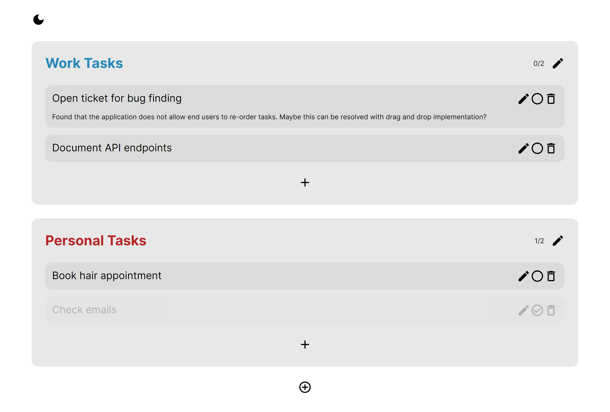

# To-Do Web Application

A simple CRUD web application to assist in managing and grouping to-do tasks.

# Planned Feature Backlog

### Tasks

-   Multi-line description support
-   Deadlines/desktop reminders for tasks

### General

-   Re-ordering for tasks and task groups
-   Switch task reducer to utilize Redux
-   User authentication system
    -   Real time updates

# Local Configuration

To run this application on your local machine,

1. Install Docker, and navigate to **`server\`**. Run **`docker-compose up -d --build`** to build and run the server docker image. The configuration in place is only for the sake of development, and should be reconsidered for any production deployment in the interest of security. By default, the API will run on port 8080. This can be adjusted if necessary within **`server\app.js`**, **`server\docker-compose.yml`**, and **`server\Dockerfile`**. Any changes to the port must also be made within **`client\.env`**. This will be streamlined into .env files within future updates.

2. At **`client\`**, run `npm install` and then `npm start` to start the application. Alternatively, `npm build` can be used to compile the React code.

# Tech Stack

-   Node (Express)
-   Docker
-   MySQL
-   React.js
-   TypeScript
